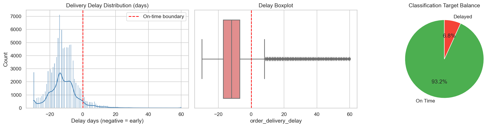

# **Olist Delivery Delay Prediction**

This project started as a pandas and NumPy learning exercise on the Brazilian Olist ecommerce dataset, then evolved into an end-to-end machine learning project for delivery delay prediction.

The goal is not only to train a model, but to practice a realistic data workflow: loading multiple related tables, cleaning data, performing EDA, defining a machine learning problem, engineering leakage-aware features, and evaluating regression and classification approaches.

## Project Objective

The dataset contains ecommerce orders, customers, sellers, products, payments, reviews, and geolocation data. The main business problem is:

> Can we predict whether an order will be delivered late?

The project first explores delivery delay as a regression problem:

```text
order_delivery_delay = actual_delivery_date - estimated_delivery_date
```

Later, the problem is reframed as a binary classification problem:

```text
is_delayed = 1 if order_delivery_delay > 0 else 0
```

This classification framing is more practical because exact delivery delay is noisy and difficult to predict, while identifying delayed orders is more directly useful for business action.

## Dataset

The project uses the Olist Brazilian ecommerce public dataset.

Main tables:

- `customers.csv`
- `orders.csv`
- `order_items.csv`
- `order_payments.csv`
- `order_reviews.csv`
- `products.csv`
- `sellers.csv`
- `geolocation.csv`
- `product_category_name_translation.csv`

The raw data is stored in:

```text
data/
```

Cleaned and generated files are stored in:

```text
artifact/
```

## Project Structure

```text
Olist Project/
├── data/
│   └── raw Olist CSV files
├── artifact/
│   └── cleaned parquet files and generated ML datasets
├── notebooks/
│   ├── 01_pandas_numpy_practice_olist.ipynb
│   ├── 02_data_loading_cleaning.ipynb
│   ├── 03_eda_problem_framing.ipynb
│   └── 04_feature_engineering_modeling.ipynb
├── documentation/
│   └── learning reference notebooks
├── catboost_info/
│   └── CatBoost training logs
├── README.md
└── requirements.txt
|__environment.yml
```

## Notebook Workflow

### 1. Pandas and NumPy Practice

Notebook:

```text
notebooks/01_pandas_numpy_practice_olist.ipynb
```

This notebook was the starting point of the project. It focuses on learning and practicing pandas/NumPy using a realistic multi-table dataset.

Main work:

- Loading multiple CSV files
- Inspecting shapes, columns, datatypes, and missing values
- Practicing joins and table relationships
- Understanding ecommerce entities such as orders, customers, sellers, products, payments, and reviews
- Applying basic pandas operations on a larger real-world dataset

### 2. Data Loading and Cleaning

Notebook:

```text
notebooks/02_data_loading_cleaning.ipynb
```

This notebook prepares the raw dataset for analysis.

Main work:

- Loading raw CSV files from `data/`
- Parsing datetime columns
- Fixing column name typos such as product length/description fields
- Checking missing values and duplicates
- Saving cleaned data as parquet files in `artifact/`

Using parquet files improves loading speed and preserves cleaner datatypes for later notebooks.

### 3. EDA and Problem Framing

Notebook:

```text
notebooks/03_eda_problem_framing.ipynb
```

This notebook moves the work from pandas practice into project thinking.

Main work:

- Exploring column types and cardinality
- Creating the delivery delay target
- Studying the distribution of delivery delays
- Analyzing delayed vs on-time orders
- Identifying class imbalance
- Framing the ML problem as both regression and classification

Important observation:

Most orders are delivered before the estimated delivery date, while delayed orders are relatively rare. This makes the classification problem imbalanced.

### 4. Feature Engineering and Modeling

Notebook:

```text
notebooks/04_feature_engineering_modeling.ipynb
```

This is the main machine learning notebook.

Main work:

- Building order-level, product-level, seller-level, customer-level, and category-level features
- Creating temporal features from purchase date
- Creating rolling historical features using `shift()` to reduce leakage
- Creating cold-start indicators for entities with no previous history
- Using temporal train/test split instead of random split
- Training CatBoost models
- Comparing regression and classification approaches

## Feature Engineering

The project uses several groups of features.

Order-level features:

- Total order value
- Total freight
- Number of items
- Number of sellers
- Number of categories
- Total weight
- Total volume
- Average item price
- Freight percentage
- Multi-seller flag

Time-based features:

- Purchase hour
- Purchase day
- Purchase month
- Purchase weekday
- Weekend flag
- Month start/end flags
- Quarter
- Year end flag
- Brazilian holiday flag

Historical rolling features:

- Product rolling average price
- Product rolling average freight
- Seller rolling average delay
- Seller rolling average freight
- Customer rolling average order value
- Customer rolling average delay
- Category rolling average delay
- Category rolling average freight

Cold-start features:

- Product has history
- Seller has history
- Customer has history

## Leakage Handling

One of the main learning points in this project was identifying and reducing data leakage.

Columns that directly reveal future delivery outcomes are removed from model features, such as:

- Actual delivery date
- Carrier delivery date
- Estimated delivery date
- Actual carrier delay
- Final delivery delay target
- `is_delayed` target

Historical rolling features are calculated using shifted rolling windows, so the current order does not use its own target value when creating historical aggregates.

The project also uses a temporal train/test split:

```text
Older orders -> training set
Newer orders -> test set
```

This is more realistic for ecommerce and logistics data than a random split because future data should not influence past training examples.

## Modeling Approach

Two problem framings are explored:

### Regression

Target:

```text
order_delivery_delay
```

Goal:

Predict the number of days an order is early or late.

This proved difficult because the target is noisy, skewed, and affected by many external logistics factors.

### Classification

Target:

```text
is_delayed
```

Goal:

Predict whether an order will be delayed.

This became the stronger final framing because it is easier to explain and more useful from a business perspective.

## Models Used

The final modeling notebook uses CatBoost because:

- It works well with tabular data
- It can handle categorical features directly
- It performs well on nonlinear relationships
- It supports class weights for imbalanced classification

Models trained:

- `CatBoostRegressor`
- `CatBoostClassifier`

Classification metrics include:

- Precision
- Recall
- F1-score
- ROC-AUC
- PR-AUC
- Confusion matrix

For this problem, delayed-order recall and PR-AUC are especially important because delayed orders are the minority class.

## Key Learnings

This project helped practice:

- Working with multi-table relational data in pandas
- Cleaning and saving large datasets efficiently
- Defining ML targets from business logic
- Understanding regression vs classification framing
- Detecting and fixing leakage risks
- Creating entity-level and temporal features
- Using rolling historical features
- Handling class imbalance
- Training CatBoost on tabular ecommerce data
- Building a project from exploratory notebooks

## Screenshots

Add screenshots in this section after running the notebooks.

Recommended screenshots:

### 1. Dataset Loading Summary


### 2. Missing Values / Data Cleaning


### 3. Delivery Delay Distribution



### 4. Cardinality Analysis


### 5. Feature Engineering Output


### 6. CatBoost Regression Results

Add a screenshot showing:

- MAE
- RMSE
- R2 score


Other images :


## How To Run

Install dependencies:

```bash
pip install -r requirements.txt
```

Run notebooks in this order:

```text
1. notebooks/01_pandas_numpy_practice_olist.ipynb
2. notebooks/02_data_loading_cleaning.ipynb
3. notebooks/03_eda_problem_framing.ipynb
4. notebooks/04_feature_engineering_modeling.ipynb
```

The first notebook is mainly for learning practice. The main project pipeline starts from notebook 2.

## Current Status

The project is structured as a portfolio-ready learning project.

## Final Note

This project represents a learning journey from pandas/NumPy practice to a realistic machine learning workflow. The most important part of the project is not only the final model score, but the improvement in problem framing, feature engineering, leakage awareness, and evaluation thinking.
